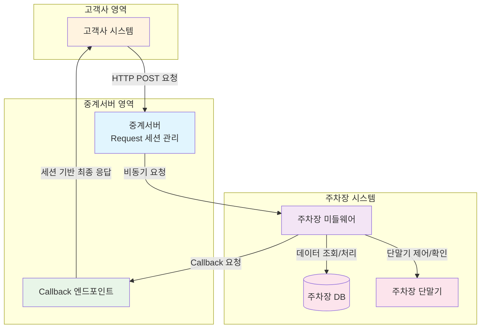
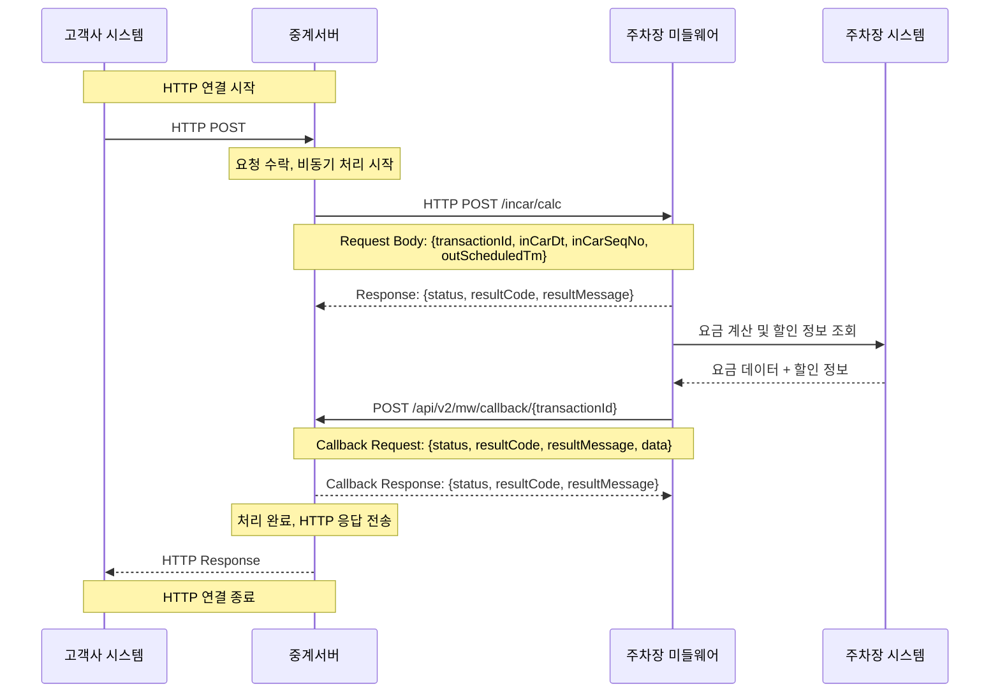
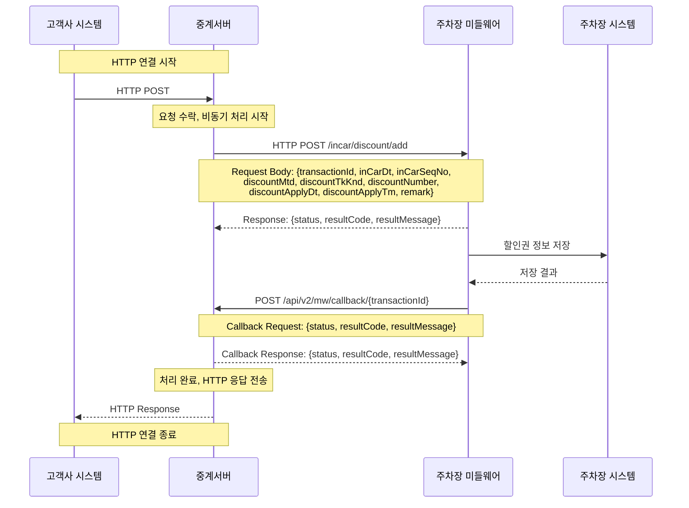
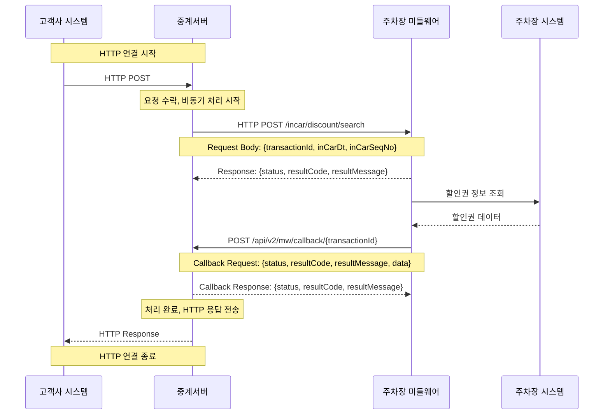
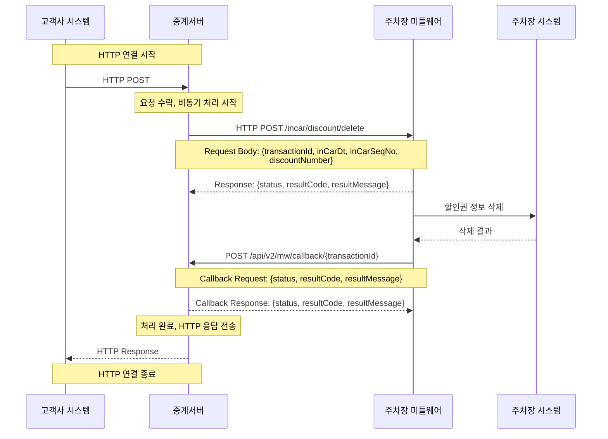

# 중계서버-미들웨어 API 통합 문서

## 📋 목차
1. [시스템 개요](#시스템-개요)
2. [API 호출 플로우](#api-호출-플로우)
3. [API 상세 규격](#api-상세-규격)
4. [에러 코드](#에러-코드)
5. [예제](#예제)

---

## 🏗️ 시스템 개요

### 전체 시스템 아키텍처



### 주요 특징
- **중계서버 ↔ 미들웨어**: 비동기 처리 (Callback 방식)
- **미들웨어**: 주차장 DB 및 단말기와의 통신 담당
- **모든 API**: HTTP POST 방식으로 호출

### 콜백 처리 방식
- 모든 Request Body에는 `transactionId`가 존재
- 미들웨어에서 중계서버로 응답 시 `/api/v2/mw/callback/{transactionId}` 형태로 호출
- 모든 프로토콜은 HTTP POST로 호출

---

## 🔄 API 호출 플로우

### 1. 입차 조회 플로우

#### 시퀀스 다이어그램


#### API 엔드포인트
- **URL**: `POST /incar/search`
- **설명**: 차량번호로 입차 정보를 조회합니다.

#### 📥 Request (중계서버 → 미들웨어)
| 필드명 | 타입 | 필수 | 설명 | 예시 |
|--------|------|------|------|------|
| transactionId | string | Y | 트랜잭션 ID (UUID) | "550e8400-e29b-41d4-a716-446655440000" |
| carNo | string | Y | 차량번호 | "12가3456" |
| periodDays | integer | Y | 조회 기간 (일수) | 7 |

#### 📤 Response (미들웨어 → 중계서버)
```json
{
  "status": "200",
  "resultCode": "success",
  "resultMessage": "요청을 수락했습니다."
}
```

#### 📥 Callback Request (미들웨어 → 중계서버)
**URL**: `POST /api/v2/mw/callback/{transactionId}`

```json
{
  "status": "200",
  "resultCode": "success",
  "resultMessage": "정상 처리되었습니다.",
  "data": {
    "inCarDt": "20150710",
    "inCarSeqNo": "000001",
    "carNo": "11가1234",
    "inCarTm": "090000",
    "inParkCustTy": "1",
    "inParkCutyTyName": "일반고객"
  }
}
```

#### 📤 Callback Response (중계서버 → 미들웨어)
```json
{
  "status": "200",
  "resultCode": "success",
  "resultMessage": "Callback을 수신했습니다."
}
```

---

### 2. 요금 조회 플로우

#### 시퀀스 다이어그램


#### API 엔드포인트
- **URL**: `POST /incar/calc`
- **설명**: 입차 정보를 기반으로 주차 요금을 계산합니다.

#### 📥 Request (중계서버 → 미들웨어)
| 필드명 | 타입 | 필수 | 설명 | 예시 |
|--------|------|------|------|------|
| transactionId | string | Y | 트랜잭션 ID (UUID) | "550e8400-e29b-41d4-a716-446655440001" |
| inCarDt | string | Y | 입차일자 (YYYYMMDD) | "20150710" |
| inCarSeqNo | string | Y | 입차순번 | "000001" |
| outScheduledTm | string | Y | 출차예정시간 (YYYYMMDDHHMMSS) | "20250714170000" |

#### 📤 Response (미들웨어 → 중계서버)
```json
{
  "status": "200",
  "resultCode": "success",
  "resultMessage": "요청을 수락했습니다."
}
```

#### 📥 Callback Request (미들웨어 → 중계서버)
**URL**: `POST /api/v2/mw/callback/{transactionId}`

```json
{
  "status": "200",
  "resultCode": "success",
  "resultMessage": "정상 처리되었습니다.",
  "data": {
    "inCarDt": "20150710",
    "inCarSeqNo": "000001",
    "carNo": "11가1234",
    "inCarTm": "090000",
    "outScheduledTm": "20250714170000",
    "originalParkChrg": 5000,
    "discountChrg": 3000,
    "parkChrg": 2000,
    "discountInfo": [
      {
        "discountMtd": "할인방식",
        "discountTkKnd": "할인권종류",
        "discountAmt": 1000,
        "webDiscountRegSeq": "0001",
        "discountNumber": "discount123456",
        "remark": "비고"
      }
    ]
  }
}
```

#### 📤 Callback Response (중계서버 → 미들웨어)
```json
{
  "status": "200",
  "resultCode": "success",
  "resultMessage": "Callback을 수신했습니다."
}
```

---

### 3. 할인권 등록 플로우

#### 시퀀스 다이어그램


#### API 엔드포인트
- **URL**: `POST /incar/discount/add`
- **설명**: 주차 할인권을 등록합니다.

#### 📥 Request (중계서버 → 미들웨어)
| 필드명 | 타입 | 필수 | 설명 | 예시 |
|--------|------|------|------|------|
| transactionId | string | Y | 트랜잭션 ID (UUID) | "550e8400-e29b-41d4-a716-446655440002" |
| inCarDt | string | Y | 입차일자 (YYYYMMDD) | "20150710" |
| inCarSeqNo | string | Y | 입차순번 | "000001" |
| discountMtd | string | Y | 할인방법 | "할인방식" |
| discountTkKnd | string | Y | 할인권종류 | "할인권종류" |
| discountNumber | string | Y | 할인번호 | "discount123456" |
| discountApplyDt | string | Y | 할인적용일자 (YYYYMMDD) | "20250704" |
| discountApplyTm | string | Y | 할인적용시간 (HHMMSS) | "090000" |
| remark | string | N | 비고 | "비고" |

#### 📤 Response (미들웨어 → 중계서버)
```json
{
  "status": "200",
  "resultCode": "success",
  "resultMessage": "요청을 수락했습니다."
}
```

#### 📥 Callback Request (미들웨어 → 중계서버)
**URL**: `POST /api/v2/mw/callback/{transactionId}`

```json
{
  "status": "200",
  "resultCode": "success",
  "resultMessage": "정상 처리되었습니다."
}
```

#### 📤 Callback Response (중계서버 → 미들웨어)
```json
{
  "status": "200",
  "resultCode": "success",
  "resultMessage": "Callback을 수신했습니다."
}
```

---

### 4. 할인권 조회 플로우

#### 시퀀스 다이어그램


#### API 엔드포인트
- **URL**: `POST /incar/discount/search`
- **설명**: 등록된 할인권 정보를 조회합니다.

#### 📥 Request (중계서버 → 미들웨어)
| 필드명 | 타입 | 필수 | 설명 | 예시 |
|--------|------|------|------|------|
| transactionId | string | Y | 트랜잭션 ID (UUID) | "550e8400-e29b-41d4-a716-446655440003" |
| inCarDt | string | Y | 입차일자 (YYYYMMDD) | "20150710" |
| inCarSeqNo | string | Y | 입차순번 | "000001" |

#### 📤 Response (미들웨어 → 중계서버)
```json
{
  "status": "200",
  "resultCode": "success",
  "resultMessage": "요청을 수락했습니다."
}
```

#### 📥 Callback Request (미들웨어 → 중계서버)
**URL**: `POST /api/v2/mw/callback/{transactionId}`

```json
{
  "status": "200",
  "resultCode": "success",
  "resultMessage": "정상 처리되었습니다.",
  "data": {
    "discountInfo": [
      {
        "discountMtd": "할인방식",
        "discountTkKnd": "할인권종류",
        "discountAmt": 1000,
        "webDiscountRegSeq": "0001",
        "discountNumber": "discount123456",
        "remark": "비고"
      }
    ]
  }
}
```

#### 📤 Callback Response (중계서버 → 미들웨어)
```json
{
  "status": "200",
  "resultCode": "success",
  "resultMessage": "Callback을 수신했습니다."
}
```

---

### 5. 할인권 삭제 플로우

#### 시퀀스 다이어그램


#### API 엔드포인트
- **URL**: `POST /incar/discount/delete`
- **설명**: 등록된 할인권을 삭제합니다.

#### 📥 Request (중계서버 → 미들웨어)
| 필드명 | 타입 | 필수 | 설명 | 예시 |
|--------|------|------|------|------|
| transactionId | string | Y | 트랜잭션 ID (UUID) | "550e8400-e29b-41d4-a716-446655440004" |
| inCarDt | string | Y | 입차일자 (YYYYMMDD) | "20150710" |
| inCarSeqNo | string | Y | 입차순번 | "000001" |
| discountNumber | string | Y | 할인번호 | "discount123456" |

#### 📤 Response (미들웨어 → 중계서버)
```json
{
  "status": "200",
  "resultCode": "success",
  "resultMessage": "요청을 수락했습니다."
}
```

#### 📥 Callback Request (미들웨어 → 중계서버)
**URL**: `POST /api/v2/mw/callback/{transactionId}`

```json
{
  "status": "200",
  "resultCode": "success",
  "resultMessage": "정상 처리되었습니다."
}
```

#### 📤 Callback Response (중계서버 → 미들웨어)
```json
{
  "status": "200",
  "resultCode": "success",
  "resultMessage": "Callback을 수신했습니다."
}
```

---

## 📋 API 상세 규격

### 공통 필드 구조

#### Request 공통 필드
모든 API 요청에는 다음 필드가 포함됩니다:
- `transactionId`: 트랜잭션 ID (필수)

#### Response 공통 필드
모든 API 응답에는 다음 필드가 포함됩니다:
- `status`: 상태 (SUCCESS/ERROR)
- `resultCode`: 결과 코드
- `resultMessage`: 결과 메시지
- `data`: 실제 업무 데이터 (선택적)

### Callback 처리 규칙
1. **Callback URL**: `/api/v2/mw/callback/{transactionId}`
2. **HTTP Method**: POST
3. **Content-Type**: application/json
4. **타임아웃**: 30초
5. **재시도**: 최대 3회

---

## ⚠️ 에러 코드

| 에러 코드 | 설명 | HTTP 상태 코드 |
|-----------|------|----------------|
| success | 정상 처리 | 200 |
| 4001 | 필수 파라미터 누락 | 400 |
| 4002 | 인증 실패 | 401 |
| 4003 | 권한 없음 | 403 |
| 4004 | 리소스 없음 | 404 |
| 5001 | 서버 내부 오류 | 500 |
| 5002 | 미들웨어 통신 오류 | 500 |
| 5003 | 타임아웃 | 408 |

---

## 💡 예제

### 입차 조회 예제

#### 📥 중계서버 요청
```bash
curl -X POST https://middleware.example.com/incar/search \
  -H "Content-Type: application/json" \
  -d '{
    "transactionId": "550e8400-e29b-41d4-a716-446655440000",
    "carNo": "11가1234",
    "periodDays": 7
  }'
```

#### 📤 미들웨어 즉시 응답
```json
{
  "status": "200",
  "resultCode": "success",
  "resultMessage": "요청을 수락했습니다."
}
```

#### 📥 미들웨어 Callback (나중에 전송)
```bash
curl -X POST https://relay.example.com/api/v2/mw/callback/550e8400-e29b-41d4-a716-446655440000 \
  -H "Content-Type: application/json" \
  -d '{
    "status": "200",
    "resultCode": "success",
    "resultMessage": "정상 처리되었습니다.",
    "data": {
      "inCarDt": "20150710",
      "inCarSeqNo": "000001",
      "carNo": "11가1234",
      "inCarTm": "090000",
      "inParkCustTy": "1",
      "inParkCutyTyName": "일반고객"
    }
  }'
```

#### 📤 중계서버 Callback 응답
```json
{
  "status": "200",
  "resultCode": "success",
  "resultMessage": "Callback을 수신했습니다."
}
```

---

## 🔧 개발 가이드

### 1. 트랜잭션 ID 생성 규칙
- 형식: `UUID v4`
- 예시: `550e8400-e29b-41d4-a716-446655440000`
- 생성 방법: 표준 UUID 라이브러리 사용

### 2. 날짜/시간 형식
- 날짜: `YYYYMMDD` (예: 20241201)
- 시간: `HHMMSS` (예: 153000)

### 3. 비동기 처리 고려사항
- 모든 API는 즉시 응답 후 비동기 처리
- Callback 타임아웃: 30초
- 재시도 로직 구현 권장

### 4. 에러 처리
- HTTP 상태 코드와 resultCode 모두 확인
- 네트워크 오류 시 재시도
- Callback 미수신 시 타임아웃 처리

---

## 📚 관련 문서
- [OpenAPI 스펙 파일](./api_specification.yaml)
- [시퀀스 다이어그램](./api_flow_diagram.md)
- [프로토콜 정의](./protocol.txt) 
