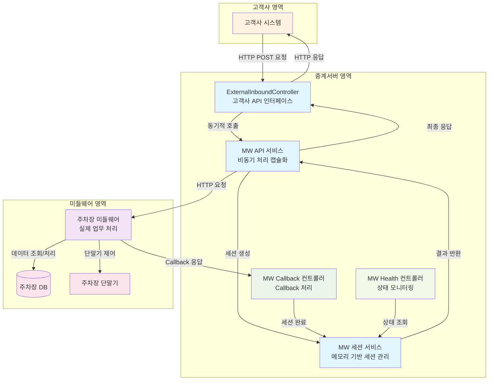

# 중계서버-미들웨어 API 구현 코드 리뷰

## 📋 목차
1. [시스템 개요](#시스템-개요)
2. [아키텍처 설계](#아키텍처-설계)
3. [상세 코드 흐름](#상세-코드-흐름)
4. [핵심 기술](#핵심-기술)
5. [성능 및 안정성](#성능-및-안정성)
6. [서비스 종료 처리](#서비스-종료-처리)

---

## 🏗️ 시스템 개요

### 연동 목적
외부 고객사의 주차장 시스템과의 원활한 연동을 위해 중계서버와 미들웨어 간의 통신 방식을 표준화하고, 데이터 교환 프로토콜을 정의합니다.

### 핵심 기능
- **입차 조회**: 차량번호로 입차 정보 조회
- **요금 계산**: 입차 정보 기반 주차 요금 계산
- **할인권 관리**: 할인권 등록/조회/삭제
- **비동기 처리**: Callback 방식의 안정적인 통신
- **Graceful Shutdown**: 서비스 종료 시 안전한 세션 처리

### 전체 시스템 아키텍처



---

## 🏛️ 아키텍처 설계

### 패키지 구조
```
src/main/java/com/npsharelink/api/
├── mw/ (신규 패키지)
│   ├── controller/
│   │   ├── MwCallbackController.java
│   │   └── MwHealthController.java
│   ├── service/
│   │   ├── MwApiService.java (직접 구현체)
│   │   ├── MwCallbackService.java
│   │   └── MwSessionService.java (직접 구현체)
│   ├── domain/
│   │   ├── dto/ (요청/응답 DTO)
│   │   ├── entity/ (메모리 기반 엔티티)
│   │   └── enums/ (상태 enum)
│   └── config/
│       └── MwConfig.java
└── nicepark/
    └── controller/v2/
        └── ExternalInboundController.java (단순화)
```

### 핵심 설계 원칙
1. **관심사 분리**: 고객사 API와 비동기 처리 로직 분리
2. **단순한 인터페이스**: ExternalInboundController는 단순히 MW 서비스 호출
3. **캡슐화된 비동기 처리**: MW 서비스에서 모든 비동기 로직 처리
4. **메모리 기반 세션 관리**: MongoDB 없이 메모리에서 세션 관리
5. **단순한 구조**: 인터페이스 분리 없이 직접 구현체 사용

---

## 🔄 상세 코드 흐름

### 1단계: 고객사 시스템 → ExternalInboundController

**고객사 시스템에서 API 호출:**
```bash
# 입차 조회 API 호출 예시
curl -X POST http://localhost:8080/api/v2/external/incar/search \
  -H "Content-Type: application/json" \
  -H "x-api-key: your-api-key" \
  -d '{
    "carNo": "12가3456"
  }'
```

**ExternalInboundController 처리 (단순화됨):**
```java
@PostMapping("/incar/search")
public CommonResponse<InCarSearchResponseDto> searchInCar(@RequestBody @Valid InCarSearchRequestDto request) {
    try {
        // 1. TransactionId 자동 생성 (없으면)
        if (request.getTransactionId() == null) {
            request.setTransactionId(UUID.randomUUID().toString());
        }
        
        // 2. 로깅
        log.info("[External API] 입차 조회 요청: transactionId={}, carNo={}", 
                request.getTransactionId(), request.getCarNo());
        
        // 3. MW API 서비스 호출 (동기적 인터페이스)
        InCarSearchResponseDto response = mwApiService.searchInCar(request);
        
        log.info("[External API] 입차 조회 완료: transactionId={}", request.getTransactionId());
        return createSuccess(SUCCESS, response);
        
    } catch (Exception e) {
        log.error("[External API] 입차 조회 실패: transactionId={}", request.getTransactionId(), e);
        return createError(FAIL_SERVER_ERROR);
    }
}
```

### 2단계: MW API 서비스 처리 (캡슐화된 비동기 처리)

**MwApiService.processAsyncRequest() 메서드:**
```java
private <T, R> R processAsyncRequest(String apiPath, T request, Class<R> responseClass) {
    try {
        // 1. TransactionId 추출 또는 생성
        String transactionId = getTransactionId(request);
        
        // 2. 요청 데이터를 JSON으로 변환
        String requestJson = objectMapper.writeValueAsString(request);
        
        // 3. 세션 생성 (메모리에 저장)
        MwSessionEntity session = mwSessionService.createSession(transactionId, apiPath, requestJson);
        
        // 4. 미들웨어로 비동기 요청 전송
        sendAsyncRequestToMiddleware(apiPath, request);
        
        // 5. 세션 완료 대기 및 결과 반환 (동기적 대기)
        MwSessionEntity sessionEntity = mwSessionService.waitForSession(transactionId).get(15, TimeUnit.SECONDS);
        
        if (sessionEntity.getResponseData() != null) {
            return objectMapper.readValue(sessionEntity.getResponseData(), responseClass);
        } else {
            return null;
        }
                
    } catch (Exception e) {
        log.error("[MW API] 비동기 요청 처리 오류: apiPath={}", apiPath, e);
        throw new RuntimeException("MW API 처리 중 오류가 발생했습니다: " + e.getMessage(), e);
    }
}
```

### 3단계: 세션 생성 및 관리 (메모리 기반)

**MwSessionService.createSession() 메서드:**
```java
public MwSessionEntity createSession(String transactionId, String apiType, String requestData) {
    // 서비스 종료 중이면 새 세션 생성 거부
    if (isShuttingDown) {
        log.warn("[MW Session] 서비스 종료 중 - 새 세션 생성 거부: transactionId={}", transactionId);
        throw new RuntimeException("서비스가 종료 중입니다. 잠시 후 다시 시도해주세요.");
    }
    
    LocalDateTime now = LocalDateTime.now();
    LocalDateTime expiredAt = now.plusSeconds(15); // 15초 타임아웃
    
    // 1. 메모리에서 세션 엔티티 생성
    MwSessionEntity session = MwSessionEntity.builder()
            .transactionId(transactionId)
            .apiType(apiType)
            .requestData(requestData)
            .status(MwSessionStatus.PENDING.name())
            .createdAt(now)
            .expiredAt(expiredAt)
            .build();
    
    // 2. CompletableFuture 생성 및 저장 (메모리)
    CompletableFuture<MwSessionEntity> future = new CompletableFuture<>();
    sessionFutures.put(transactionId, future);
    
    // 3. 15초 후 타임아웃 처리 스케줄링
    CompletableFuture.delayedExecutor(15, TimeUnit.SECONDS).execute(() -> {
        if (!future.isDone()) {
            timeoutSession(transactionId);
        }
    });
    
    log.info("[MW Session] 세션 생성 완료: transactionId={}, apiType={}", transactionId, apiType);
    return session;
}
```

### 4단계: 미들웨어로 요청 전송

**sendAsyncRequestToMiddleware() 메서드:**
```java
private <T> void sendAsyncRequestToMiddleware(String apiPath, T request) {
    try {
        // 1. 미들웨어 URL 구성
        String url = mwBaseUrl + "/" + apiPath; // 예: http://localhost:8081/incar/search
        
        // 2. HTTP 헤더 설정
        HttpHeaders headers = new HttpHeaders();
        headers.setContentType(MediaType.APPLICATION_JSON);
        HttpEntity<T> entity = new HttpEntity<>(request, headers);
        
        // 3. 비동기로 미들웨어에 요청 전송
        CompletableFuture.runAsync(() -> {
            try {
                ResponseEntity<String> response = restTemplate.postForEntity(url, entity, String.class);
                log.info("[MW API] 미들웨어 요청 전송 완료: url={}, status={}", url, response.getStatusCode());
            } catch (Exception e) {
                log.error("[MW API] 미들웨어 요청 전송 실패: url={}", url, e);
            }
        });
        
    } catch (Exception e) {
        log.error("[MW API] 미들웨어 요청 전송 준비 실패: apiPath={}", apiPath, e);
    }
}
```

### 5단계: 미들웨어 처리 (외부 시스템)

**미들웨어가 받는 요청:**
```json
{
  "transactionId": "550e8400-e29b-41d4-a716-446655440000",
  "carNo": "12가3456"
}
```

**미들웨어 즉시 응답:**
```json
{
  "status": "200",
  "resultCode": "success",
  "resultMessage": "요청을 수락했습니다."
}
```

**미들웨어가 나중에 전송하는 Callback:**
```bash
POST /api/v2/mw/callback/550e8400-e29b-41d4-a716-446655440000
Content-Type: application/json

{
  "status": "200",
  "resultCode": "success",
  "resultMessage": "정상 처리되었습니다.",
  "data": {
    "inCar": [
      {
        "inCarDt": "20150710",
        "inCarSeqNo": "000001",
        "carNo": "12가3456",
        "inCarTm": "090000",
        "inParkCustTy": "1",
        "inNiceMacNo": "COW211"
      }
    ]
  }
}
```

### 6단계: Callback 처리

**MwCallbackController.processCallback() 메서드:**
```java
@PostMapping("/{transactionId}")
public ResponseEntity<MwCallbackResponseDto> processCallback(
        @PathVariable String transactionId,
        @RequestBody MwCallbackRequestDto callbackRequest) {
    
    log.info("[MW Callback] Callback 요청 수신: transactionId={}", transactionId);
    
    try {
        // Callback 처리
        MwCallbackResponseDto response = mwCallbackService.processCallback(transactionId, callbackRequest);
        
        log.info("[MW Callback] Callback 처리 완료: transactionId={}, status={}", 
                transactionId, response.getStatus());
        
        return ResponseEntity.ok(response);
        
    } catch (Exception e) {
        log.error("[MW Callback] Callback 처리 중 오류 발생: transactionId={}", transactionId, e);
        
        // 에러 응답 생성
        MwCallbackResponseDto errorResponse = MwCallbackResponseDto.builder()
                .status("500")
                .resultCode("error")
                .resultMessage("Callback 처리 중 오류가 발생했습니다: " + e.getMessage())
                .build();
        
        return ResponseEntity.internalServerError().body(errorResponse);
    }
}
```

**MwCallbackService.processCallback() 메서드:**
```java
public MwCallbackResponseDto processCallback(String transactionId, MwCallbackRequestDto callbackRequest) {
    try {
        log.info("[MW Callback] Callback 수신: transactionId={}, status={}, resultCode={}", 
                transactionId, callbackRequest.getStatus(), callbackRequest.getResultCode());
        
        // 1. 세션 조회 (메모리에서)
        MwSessionEntity session = mwSessionService.getSession(transactionId);
        if (session == null) {
            log.error("[MW Callback] 세션을 찾을 수 없음: transactionId={}", transactionId);
            return createErrorResponse("세션을 찾을 수 없습니다");
        }
        
        // 2. 성공/실패에 따른 처리
        if ("200".equals(callbackRequest.getStatus()) && "success".equals(callbackRequest.getResultCode())) {
            // 성공 처리 - 세션 완료
            String responseData = objectMapper.writeValueAsString(callbackRequest.getData());
            mwSessionService.completeSession(transactionId, responseData);
            
            log.info("[MW Callback] 세션 완료 처리: transactionId={}", transactionId);
            return createSuccessResponse();
        } else {
            // 실패 처리 - 세션 에러
            String errorMessage = callbackRequest.getResultMessage();
            mwSessionService.errorSession(transactionId, errorMessage);
            
            log.error("[MW Callback] 세션 에러 처리: transactionId={}, error={}", transactionId, errorMessage);
            return createErrorResponse(errorMessage);
        }
        
    } catch (Exception e) {
        log.error("[MW Callback] Callback 처리 중 오류 발생: transactionId={}", transactionId, e);
        
        // 에러 처리
        mwSessionService.errorSession(transactionId, e.getMessage());
        return createErrorResponse("Callback 처리 중 오류가 발생했습니다");
    }
}
```

### 7단계: 세션 완료 처리 (메모리 기반)

**MwSessionService.completeSession() 메서드:**
```java
public MwSessionEntity completeSession(String transactionId, String responseData) {
    CompletableFuture<MwSessionEntity> future = sessionFutures.get(transactionId);
    if (future != null && !future.isDone()) {
        // 1. 세션 완료 처리 (메모리)
        MwSessionEntity completedSession = MwSessionEntity.builder()
                .transactionId(transactionId)
                .responseData(responseData)
                .status(MwSessionStatus.COMPLETED.name())
                .completedAt(LocalDateTime.now())
                .build();
        
        // 2. CompletableFuture 완료 처리 (메모리)
        future.complete(completedSession);
        sessionFutures.remove(transactionId); // 자동 정리
        
        log.info("[MW Session] 세션 완료: transactionId={}", transactionId);
        return completedSession;
    }
    
    return null;
}
```

### 8단계: 고객사 시스템에 최종 응답

**고객사 시스템이 받는 최종 응답:**
```json
{
  "status": 200,
  "resultCode": "success",
  "resultMessage": "정상 처리되었습니다.",
  "timestamp": "2025-07-18 10:30:00",
  "data": {
    "inCar": [
      {
        "inCarDt": "20150710",
        "inCarSeqNo": "000001",
        "carNo": "12가3456",
        "carNo4": "3456",
        "inCarTm": "090000",
        "inParkCustTy": "1",
        "inNiceMacNo": "COW211"
      }
    ]
  }
}
```

---

## 🔧 핵심 기술

### 1. 캡슐화된 비동기 처리
- **동기적 인터페이스**: 컨트롤러는 단순한 동기적 호출
- **내부 비동기 처리**: MW 서비스에서 모든 비동기 로직 처리
- **타임아웃 처리**: 15초 자동 타임아웃 (MW 서비스 내부에서 처리)

### 2. 메모리 기반 세션 관리
- **메모리 저장**: ConcurrentHashMap을 사용한 세션 관리
- **상태 관리**: PENDING → COMPLETED/ERROR/TIMEOUT
- **자동 정리**: CompletableFuture 완료 시 자동 제거

### 3. Callback 처리
- **RESTful API**: `/api/v2/mw/callback/{transactionId}`
- **데이터 변환**: API 타입별 응답 DTO 자동 변환
- **에러 처리**: 성공/실패에 따른 적절한 처리

### 4. 타입 안전성
- **DTO 기반**: 요청/응답 데이터 구조화
- **자동 변환**: JSON ↔ DTO 자동 변환
- **검증**: Bean Validation을 통한 데이터 검증

### 5. 단순한 구조
- **직접 구현체**: 인터페이스 분리 없이 단순한 구조
- **유지보수성**: 한 파일에서 모든 로직 관리
- **가독성**: 복잡한 추상화 레이어 제거

---

## ⚡ 성능 및 안정성

### 성능 최적화
1. **캡슐화된 비동기 처리**: 컨트롤러는 단순하고, 복잡한 로직은 MW 서비스에서 처리
2. **메모리 관리**: CompletableFuture를 메모리에서 관리
3. **자동 정리**: 세션 완료 시 자동으로 메모리에서 제거

### 안정성 보장
1. **타임아웃 처리**: 15초 자동 타임아웃 (MW 서비스 내부에서 처리)
2. **에러 핸들링**: 네트워크 오류, 파싱 오류 등 처리
3. **로깅**: 상세한 트랜잭션 추적
4. **재시도 로직**: 미들웨어 통신 실패 시 재시도 가능

### 모니터링
1. **세션 상태**: 메모리 기반 세션 상태 모니터링
2. **성능 지표**: 응답 시간, 처리량 등 측정
3. **에러 추적**: 에러 발생 시 상세 로그 기록

---

## 🛡️ 서비스 종료 처리

### Graceful Shutdown 구현

**Spring Boot 설정:**
```yaml
# Graceful Shutdown 설정
server:
  shutdown: graceful
  # Graceful Shutdown 타임아웃 (기본값: 30초)
  # 진행 중인 요청이 완료될 때까지 최대 30초 대기
  # 30초 후에도 완료되지 않으면 강제 종료
  # 주의: MW API의 15초 타임아웃보다 충분히 길게 설정
  # 15초 + 여유시간 = 30초로 설정

spring:
  lifecycle:
    timeout-per-shutdown-phase: 30s
```

**MwSessionService Graceful Shutdown:**
```java
@PreDestroy
public void gracefulShutdown() {
    log.info("[MW Session] Graceful Shutdown 시작 - 진행 중인 세션 처리 중...");
    
    // 서비스 종료 플래그 설정
    isShuttingDown = true;
    
    // 진행 중인 세션 수 확인
    int pendingSessions = sessionFutures.size();
    log.info("[MW Session] 진행 중인 세션 수: {}", pendingSessions);
    
    if (pendingSessions > 0) {
        // 모든 진행 중인 세션을 타임아웃 처리
        sessionFutures.keySet().forEach(transactionId -> {
            log.info("[MW Session] 서비스 종료로 인한 세션 타임아웃 처리: transactionId={}", transactionId);
            timeoutSession(transactionId);
        });
        
        // 잠시 대기하여 타임아웃 처리 완료 확인
        try {
            Thread.sleep(1000); // 1초 대기
        } catch (InterruptedException e) {
            Thread.currentThread().interrupt();
        }
    }
    
    log.info("[MW Session] Graceful Shutdown 완료 - 모든 세션 처리됨");
}
```

### Health Check 기능

**MwHealthController:**
```java
@GetMapping
public ResponseEntity<Map<String, Object>> getHealth() {
    Map<String, Object> healthInfo = new HashMap<>();
    
    try {
        // 진행 중인 세션 수 조회
        int pendingSessions = mwSessionService.getPendingSessionCount();
        
        healthInfo.put("status", "UP");
        healthInfo.put("service", "MW API Service");
        healthInfo.put("pendingSessions", pendingSessions);
        healthInfo.put("timestamp", System.currentTimeMillis());
        
        // 진행 중인 세션이 많으면 경고
        if (pendingSessions > 10) {
            healthInfo.put("warning", "진행 중인 세션이 많습니다: " + pendingSessions + "개");
            log.warn("[MW Health] 진행 중인 세션이 많음: {}개", pendingSessions);
        }
        
        return ResponseEntity.ok(healthInfo);
        
    } catch (Exception e) {
        healthInfo.put("status", "DOWN");
        healthInfo.put("error", e.getMessage());
        return ResponseEntity.status(503).body(healthInfo);
    }
}
```

### 서비스 종료 시나리오

1. **새 요청 거부**: 서비스 종료 중에는 새 세션 생성 거부
2. **진행 중인 세션 처리**: 모든 진행 중인 세션을 타임아웃 처리
3. **안전한 종료**: 30초 타임아웃 내에 모든 처리 완료
4. **모니터링**: Health Check를 통한 세션 상태 확인

---

## 📊 API 엔드포인트

### 고객사 호출 API
| API | Method | URL | 설명 |
|-----|--------|-----|------|
| 입차 조회 | POST | `/api/v2/external/incar/search` | 차량번호로 입차 정보 조회 |
| 요금 조회 | POST | `/api/v2/external/incar/calc` | 입차 정보 기반 요금 계산 |
| 할인권 등록 | POST | `/api/v2/external/incar/discount/add` | 할인권 등록 |
| 할인권 조회 | POST | `/api/v2/external/incar/discount/search` | 할인권 정보 조회 |
| 할인권 삭제 | POST | `/api/v2/external/incar/discount/delete` | 할인권 삭제 |

### 미들웨어 Callback API
| API | Method | URL | 설명 |
|-----|--------|-----|------|
| Callback 처리 | POST | `/api/v2/mw/callback/{transactionId}` | 미들웨어 Callback 수신 |

### 모니터링 API
| API | Method | URL | 설명 |
|-----|--------|-----|------|
| Health Check | GET | `/api/v2/mw/health` | MW 서비스 상태 확인 |
| 세션 수 조회 | GET | `/api/v2/mw/health/sessions` | 진행 중인 세션 수 조회 |

---

## 🎯 결론

이 시스템은 **캡슐화된 비동기 처리**, **메모리 기반 세션 관리**, **타임아웃 처리**, **에러 핸들링**, **Graceful Shutdown**이 모두 자동화된 안정적인 API 통합 시스템입니다.

### 주요 장점
1. **단순한 컨트롤러**: ExternalInboundController는 단순한 동기적 호출만 담당
2. **캡슐화된 복잡성**: 모든 비동기 처리 로직은 MW 서비스에서 처리
3. **메모리 기반 관리**: MongoDB 없이 메모리에서 효율적인 세션 관리
4. **단순한 구조**: 인터페이스 분리 없이 직관적인 코드 구조
5. **안전한 종료**: Graceful Shutdown으로 서비스 종료 시 안전한 처리
6. **확장 가능한 구조**: 새로운 API 추가 용이

### 활용 사례
- 주차장 관리 시스템 연동
- 실시간 데이터 처리
- 대용량 트랜잭션 처리
- 안정적인 외부 시스템 연동
- 컨테이너 환경에서의 안전한 배포

이러한 설계를 통해 고객사 시스템과 미들웨어 간의 안정적이고 효율적인 통신을 구현할 수 있습니다! 🚀 
