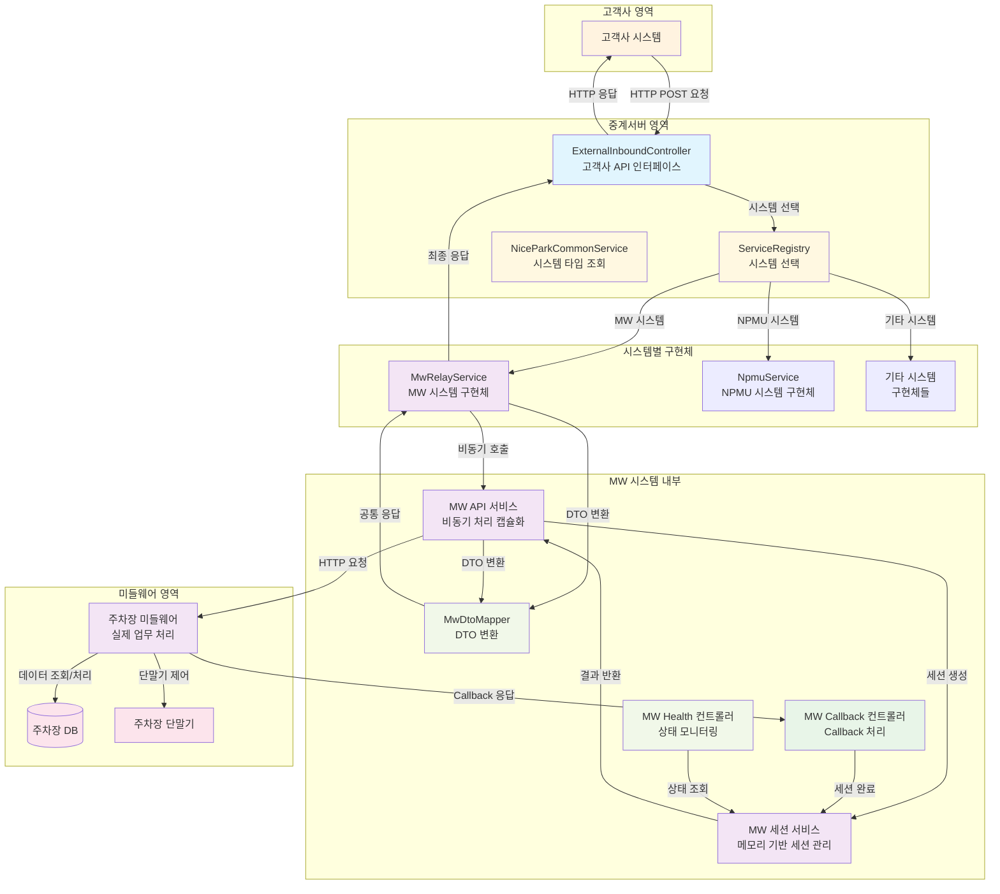

# 중계서버-미들웨어 API 구현 코드 리뷰

## 📋 목차
1. [시스템 개요](#시스템-개요)
2. [아키텍처 설계](#아키텍처-설계)
3. [상세 코드 흐름](#상세-코드-흐름)
4. [핵심 기술](#핵심-기술)
5. [성능 및 안정성](#성능-및-안정성)
6. [서비스 종료 처리](#서비스-종료-처리)
7. [리팩토링 결과](#리팩토링-결과)

---

## 🏗️ 시스템 개요

### 연동 목적
외부 고객사의 주차장 시스템과의 원활한 연동을 위해 중계서버와 미들웨어 간의 통신 방식을 표준화하고, 데이터 교환 프로토콜을 정의합니다.

### 핵심 기능
- **입차 조회**: 차량번호로 입차 정보 조회
- **요금 계산**: 입차 정보 기반 주차 요금 계산
- **할인권 관리**: 할인권 등록/조회/삭제
- **비동기 처리**: Callback 방식의 안정적인 통신
- **Graceful Shutdown**: 서비스 종료 시 안전한 세션 처리
- **통합 아키텍처**: 여러 주차시스템을 일관된 인터페이스로 통합

### 전체 시스템 아키텍처



---

## 🏛️ 아키텍처 설계

### 패키지 구조
```
src/main/java/com/npsharelink/api/
├── nicepark/ (공통 인터페이스)
│   ├── domain/dto/request/relay/ (공통 요청 DTO)
│   │   ├── InCarSearchRequestDto.java
│   │   ├── InCarCalcRequestDto.java
│   │   └── DiscountRequestDto.java
│   ├── domain/dto/response/res/relay/ (공통 응답 DTO)
│   │   ├── InCarSearchResponseDto.java
│   │   ├── InCarCalcResponseDto.java
│   │   └── DiscountResponseDto.java
│   ├── service/standard/
│   │   └── NiceParkRelayService.java (확장된 인터페이스)
│   └── controller/v2/
│       └── ExternalInboundController.java (통일된 패턴)
├── mw/ (MW 시스템 구현체)
│   ├── domain/dto/ (MW 전용 DTO - 기존 유지)
│   ├── mapper/
│   │   └── MwDtoMapper.java (DTO 변환 로직)
│   ├── service/
│   │   ├── MwRelayService.java (NiceParkRelayService 구현체)
│   │   ├── MwApiService.java (기존 비동기 처리)
│   │   ├── MwCallbackService.java
│   │   └── MwSessionService.java
│   └── controller/
│       ├── MwCallbackController.java
│       └── MwHealthController.java
└── npmu/ (NPMU 시스템 구현체)
    └── service/
        └── NpmuService.java (기존 유지)
```

### 핵심 설계 원칙
1. **통합 인터페이스**: 모든 주차시스템이 NiceParkRelayService 인터페이스 구현
2. **시스템 선택**: ServiceRegistry를 통한 동적 시스템 선택
3. **DTO 분리**: 공통 DTO와 시스템별 DTO 분리
4. **변환 로직**: Mapper를 통한 DTO 변환
5. **일관된 패턴**: 모든 API가 동일한 호출 패턴 사용

---

## 🔄 상세 코드 흐름

### 1단계: 고객사 시스템 → ExternalInboundController

**고객사 시스템에서 API 호출:**
```bash
# 입차 조회 API 호출 예시
curl -X POST http://localhost:8080/api/v2/external/incar/search \
  -H "Content-Type: application/json" \
  -H "x-api-key: your-api-key" \
  -d '{
    "carNo": "12가3456",
    "carNo4": "3456",
    "carNoN": "3456",
    "parkNo": "P001",
    "corpCd": "MW"
  }'
```

**ExternalInboundController 처리 (통일된 패턴):**
```java
@PostMapping("/incar/search")
public CommonResponse<InCarSearchResponseDto> searchInCar(@RequestBody @Valid InCarSearchRequestDto request) {
    try {
        // 1. TransactionId 자동 생성 (없으면)
        if (request.getTransactionId() == null) {
            request.setTransactionId(UUID.randomUUID().toString());
        }
        
        // 2. 로깅
        log.info("[External API] 입차 조회 요청: transactionId={}, carNo={}", 
                request.getTransactionId(), request.getCarNo());
        
        // 3. 시스템 선택 및 서비스 호출 (통일된 패턴)
        String parkNo = request.getParkNo();
        String corpCd = request.getCorpCd();
        SystemType systemType = niceParkCommonService.findSystemType(parkNo, corpCd);
        NiceParkRelayService relayService = serviceRegistry.getService(systemType.name(), NiceParkRelayService.class);
        
        // 4. MW API 서비스 호출
        InCarSearchResponseDto response = relayService.searchInCar(request);
        
        log.info("[External API] 입차 조회 완료: transactionId={}", request.getTransactionId());
        return createSuccess(SUCCESS, response);
        
    } catch (Exception e) {
        log.error("[External API] 입차 조회 실패: transactionId={}", request.getTransactionId(), e);
        return createError(FAIL_SERVER_ERROR);
    }
}
```

### 2단계: 시스템 선택 및 MwRelayService 호출

**ServiceRegistry를 통한 시스템 선택:**
```java
// niceParkCommonService.findSystemType() 결과에 따라
// "MW" → MwRelayService
// "NPMU" → NpmuService
// 기타 → 다른 시스템 구현체

NiceParkRelayService relayService = serviceRegistry.getService(systemType.name(), NiceParkRelayService.class);
```

**MwRelayService 처리:**
```java
@Override
public InCarSearchResponseDto searchInCar(InCarSearchRequestDto request) {
    try {
        log.info("[MW Relay] 입차 조회 요청: transactionId={}, carNo={}", 
                request.getTransactionId(), request.getCarNo());
        
        // 1. 공통 DTO → MW DTO 변환
        var mwRequest = mwDtoMapper.toMwRequest(request);
        
        // 2. MW API 서비스 호출 (기존 비동기 처리)
        var mwResponse = mwApiService.searchInCar(mwRequest);
        
        // 3. MW 응답 → 공통 응답 변환
        var commonResponse = mwDtoMapper.toCommonResponse(mwResponse);
        
        log.info("[MW Relay] 입차 조회 완료: transactionId={}", request.getTransactionId());
        return commonResponse;
        
    } catch (Exception e) {
        log.error("[MW Relay] 입차 조회 실패: transactionId={}", request.getTransactionId(), e);
        throw new RuntimeException("입차 조회 중 오류가 발생했습니다: " + e.getMessage(), e);
    }
}
```

### 3단계: DTO 변환 (MwDtoMapper)

**공통 DTO → MW DTO 변환:**
```java
public InCarSearchRequestDto toMwRequest(com.npsharelink.api.nicepark.domain.dto.request.relay.InCarSearchRequestDto commonRequest) {
    return InCarSearchRequestDto.builder()
            .transactionId(commonRequest.getTransactionId())
            .carNo(commonRequest.getCarNo())
            .carNo4(commonRequest.getCarNo4())
            .carNoN(commonRequest.getCarNoN())
            .build();
}
```

**MW DTO → 공통 DTO 변환:**
```java
public com.npsharelink.api.nicepark.domain.dto.response.res.relay.InCarSearchResponseDto toCommonResponse(InCarSearchResponseDto mwResponse) {
    if (mwResponse == null || mwResponse.getInCar() == null) {
        return com.npsharelink.api.nicepark.domain.dto.response.res.relay.InCarSearchResponseDto.builder()
                .inCar(List.of())
                .build();
    }

    List<com.npsharelink.api.nicepark.domain.dto.response.res.relay.InCarSearchResponseDto.InCarInfo> inCarList = mwResponse.getInCar().stream()
            .map(this::toCommonInCarInfo)
            .collect(Collectors.toList());

    return com.npsharelink.api.nicepark.domain.dto.response.res.relay.InCarSearchResponseDto.builder()
            .inCar(inCarList)
            .build();
}
```

### 4단계: 기존 MW API 서비스 처리 (변경 없음)

**MwApiService.processAsyncRequest() 메서드 (기존과 동일):**
```java
private <T, R> R processAsyncRequest(String apiPath, T request, Class<R> responseClass) {
    try {
        // 1. TransactionId 추출 또는 생성
        String transactionId = getTransactionId(request);
        
        // 2. 요청 데이터를 JSON으로 변환
        String requestJson = objectMapper.writeValueAsString(request);
        
        // 3. 세션 생성 (메모리에 저장)
        MwSessionEntity session = mwSessionService.createSession(transactionId, apiPath, requestJson);
        
        // 4. 미들웨어로 비동기 요청 전송
        sendAsyncRequestToMiddleware(apiPath, request);
        
        // 5. 세션 완료 대기 및 결과 반환 (동기적 대기)
        MwSessionEntity sessionEntity = mwSessionService.waitForSession(transactionId).get(15, TimeUnit.SECONDS);
        
        if (sessionEntity.getResponseData() != null) {
            return objectMapper.readValue(sessionEntity.getResponseData(), responseClass);
        } else {
            return null;
        }
                
    } catch (Exception e) {
        log.error("[MW API] 비동기 요청 처리 오류: apiPath={}", apiPath, e);
        throw new RuntimeException("MW API 처리 중 오류가 발생했습니다: " + e.getMessage(), e);
    }
}
```

### 5단계: 미들웨어 처리 및 Callback (기존과 동일)

**미들웨어가 받는 요청:**
```json
{
  "transactionId": "550e8400-e29b-41d4-a716-446655440000",
  "carNo": "12가3456",
  "carNo4": "3456",
  "carNoN": "3456"
}
```

**미들웨어 Callback:**
```bash
POST /api/v2/mw/callback/550e8400-e29b-41d4-a716-446655440000
Content-Type: application/json

{
  "status": "200",
  "resultCode": "success",
  "resultMessage": "정상 처리되었습니다.",
  "data": {
    "inCar": [
      {
        "inCarDt": "20150710",
        "inCarSeqNo": "000001",
        "carNo": "12가3456",
        "carNo4": "3456",
        "inCarTm": "090000",
        "inParkCustTy": "1",
        "inNiceMacNo": "COW211"
      }
    ]
  }
}
```

### 6단계: 최종 응답 (DTO 변환 후)

**고객사 시스템이 받는 최종 응답:**
```json
{
  "status": 200,
  "resultCode": "success",
  "resultMessage": "정상 처리되었습니다.",
  "timestamp": "2025-07-18 10:30:00",
  "data": {
    "inCar": [
      {
        "inCarDt": "20150710",
        "inCarSeqNo": "000001",
        "carNo": "12가3456",
        "carNo4": "3456",
        "carNoN": "3456",
        "inCarTm": "090000",
        "inParkCustTy": "1",
        "inNiceMacNo": "COW211"
      }
    ]
  }
}
```

---

## 🔧 핵심 기술

### 1. 통합 아키텍처
- **ServiceRegistry**: 동적 시스템 선택
- **NiceParkRelayService**: 통합 인터페이스
- **시스템별 구현체**: 각 시스템의 특성에 맞는 구현

### 2. DTO 분리 및 변환
- **공통 DTO**: 인터페이스에서 사용하는 표준 DTO
- **시스템별 DTO**: 각 시스템의 고유한 DTO 구조
- **Mapper**: DTO 간 변환 로직

### 3. 일관된 호출 패턴
- **모든 API**: 동일한 serviceRegistry 패턴 사용
- **시스템 선택**: parkNo, corpCd 기반 동적 선택
- **에러 처리**: 통일된 예외 처리

### 4. 기존 기능 유지
- **비동기 처리**: 기존 MwApiService 로직 유지
- **세션 관리**: 메모리 기반 세션 관리 유지
- **Callback 처리**: 기존 Callback 로직 유지

---

## ⚡ 성능 및 안정성

### 성능 최적화
1. **통합 아키텍처**: 시스템 선택 오버헤드 최소화
2. **DTO 변환**: 효율적인 변환 로직
3. **기존 최적화**: 메모리 기반 세션 관리 유지

### 안정성 보장
1. **시스템 분리**: 각 시스템의 독립성 보장
2. **에러 격리**: 한 시스템의 오류가 다른 시스템에 영향 없음
3. **기존 안정성**: 타임아웃, Graceful Shutdown 등 유지

---

## 🛡️ 서비스 종료 처리

### Graceful Shutdown 구현 (기존과 동일)

**Spring Boot 설정:**
```yaml
server:
  shutdown: graceful
  spring:
    lifecycle:
      timeout-per-shutdown-phase: 30s
```

**MwSessionService Graceful Shutdown (기존과 동일):**
```java
@PreDestroy
public void gracefulShutdown() {
    log.info("[MW Session] Graceful Shutdown 시작 - 진행 중인 세션 처리 중...");
    
    // 서비스 종료 플래그 설정
    isShuttingDown = true;
    
    // 진행 중인 세션 수 확인
    int pendingSessions = sessionFutures.size();
    log.info("[MW Session] 진행 중인 세션 수: {}", pendingSessions);
    
    if (pendingSessions > 0) {
        // 모든 진행 중인 세션을 타임아웃 처리
        sessionFutures.keySet().forEach(transactionId -> {
            log.info("[MW Session] 서비스 종료로 인한 세션 타임아웃 처리: transactionId={}", transactionId);
            timeoutSession(transactionId);
        });
        
        // 잠시 대기하여 타임아웃 처리 완료 확인
        try {
            Thread.sleep(1000); // 1초 대기
        } catch (InterruptedException e) {
            Thread.currentThread().interrupt();
        }
    }
    
    log.info("[MW Session] Graceful Shutdown 완료 - 모든 세션 처리됨");
}
```

---

## 🔄 리팩토링 결과

### 📊 아키텍처 개선

#### ✅ 개선된 점
1. **일관성 확보**: 모든 API가 동일한 패턴 사용
2. **확장성 향상**: 새로운 주차시스템 추가 용이
3. **관심사 분리**: 공통 인터페이스와 시스템별 구현의 명확한 분리
4. **DTO 분리**: 공통 DTO와 시스템별 DTO의 적절한 분리
5. **기존 기능 유지**: 비동기 처리, 세션 관리 등 기존 기능 완전 보존

#### 🏗️ 새로운 구조
```
기존: ExternalInboundController → MwApiService (직접 호출)
변경: ExternalInboundController → ServiceRegistry → NiceParkRelayService → MwRelayService → MwApiService
```

### 📁 새로운 컴포넌트

#### 1. 공통 DTO (6개)
- **InCarSearchRequestDto**: 입차 조회 요청
- **InCarCalcRequestDto**: 요금 계산 요청
- **DiscountRequestDto**: 할인권 요청
- **InCarSearchResponseDto**: 입차 조회 응답
- **InCarCalcResponseDto**: 요금 계산 응답
- **DiscountResponseDto**: 할인권 응답

#### 2. MwDtoMapper
- **공통 DTO ↔ MW DTO 변환**
- **타입 안전성 보장**
- **Null 처리 및 기본값 설정**

#### 3. MwRelayService
- **@Service("MW")**: ServiceRegistry에서 "MW"로 등록
- **NiceParkRelayService 구현체**
- **기존 MwApiService 위임**
- **DTO 변환 처리**

### 🔄 호출 흐름 변경

#### 기존 흐름
```
고객사 → ExternalInboundController → MwApiService → 미들웨어
```

#### 새로운 흐름
```
고객사 → ExternalInboundController → ServiceRegistry → MwRelayService → MwDtoMapper → MwApiService → 미들웨어
```

### 📈 장점

#### 1. **확장성**
- 새로운 주차시스템 추가 시 NiceParkRelayService만 구현
- 기존 코드 변경 없이 확장 가능

#### 2. **일관성**
- 모든 API가 동일한 패턴 사용
- 시스템 선택 로직 통일

#### 3. **유지보수성**
- 각 시스템의 독립성 보장
- 명확한 책임 분리

#### 4. **테스트 용이성**
- 인터페이스 기반 테스트 가능
- Mock 객체 사용 용이

---

## 📊 API 엔드포인트

### 고객사 호출 API (변경 없음)
| API | Method | URL | 설명 |
|-----|--------|-----|------|
| 입차 조회 | POST | `/api/v2/external/incar/search` | 차량번호로 입차 정보 조회 |
| 요금 조회 | POST | `/api/v2/external/incar/calc` | 입차 정보 기반 요금 계산 |
| 할인권 등록 | POST | `/api/v2/external/incar/discount/add` | 할인권 등록 |
| 할인권 조회 | POST | `/api/v2/external/incar/discount/search` | 할인권 정보 조회 |
| 할인권 삭제 | POST | `/api/v2/external/incar/discount/delete` | 할인권 삭제 |

### 미들웨어 Callback API (변경 없음)
| API | Method | URL | 설명 |
|-----|--------|-----|------|
| Callback 처리 | POST | `/api/v2/mw/callback/{transactionId}` | 미들웨어 Callback 수신 |

### 모니터링 API (변경 없음)
| API | Method | URL | 설명 |
|-----|--------|-----|------|
| Health Check | GET | `/api/v2/mw/health` | MW 서비스 상태 확인 |
| 세션 수 조회 | GET | `/api/v2/mw/health/sessions` | 진행 중인 세션 수 조회 |

---

## 🎯 리뷰 결과 및 개선 사항

### 📊 코드 품질 평가

#### ✅ 우수한 점
1. **통합 아키텍처**: 여러 주차시스템을 일관된 인터페이스로 통합
2. **확장성**: 새로운 시스템 추가가 용이한 구조
3. **관심사 분리**: 공통 인터페이스와 시스템별 구현의 명확한 분리
4. **DTO 분리**: 공통 DTO와 시스템별 DTO의 적절한 분리
5. **기존 기능 유지**: 비동기 처리, 세션 관리 등 기존 기능 완전 보존

#### 🔧 개선된 사항
1. **일관성 확보**: 모든 API가 동일한 serviceRegistry 패턴 사용
2. **시스템 선택**: parkNo, corpCd 기반 동적 시스템 선택
3. **DTO 변환**: Mapper를 통한 체계적인 DTO 변환
4. **에러 격리**: 시스템별 독립적인 에러 처리

### 🚀 기술적 성과

#### 아키텍처 개선
- **통합 인터페이스**: NiceParkRelayService를 통한 시스템 통합
- **동적 선택**: ServiceRegistry를 통한 런타임 시스템 선택
- **확장성**: 새로운 주차시스템 추가 용이

#### 코드 품질 향상
- **일관성**: 모든 API가 동일한 패턴 사용
- **유지보수성**: 명확한 책임 분리
- **테스트 용이성**: 인터페이스 기반 테스트 가능

#### 성능 최적화
- **기존 최적화 유지**: 메모리 기반 세션 관리
- **최소한의 오버헤드**: DTO 변환 오버헤드 최소화
- **효율적인 시스템 선택**: 빠른 시스템 선택 로직

### 📈 권장 사항

#### 단기 개선 (1-2주)
1. **테스트 코드**: MwRelayService, MwDtoMapper 단위 테스트 추가
2. **로깅 강화**: 시스템 선택 및 DTO 변환 로깅 추가
3. **에러 처리**: 시스템별 구체적인 에러 메시지 개선

#### 중기 개선 (1-2개월)
1. **성능 모니터링**: DTO 변환 성능 측정
2. **캐싱 전략**: 시스템 선택 결과 캐싱
3. **설정 외부화**: 시스템별 설정 분리

#### 장기 개선 (3-6개월)
1. **마이크로서비스 전환**: 시스템별 독립 서비스 분리
2. **API 버전 관리**: 공통 DTO 버전 관리 체계
3. **분산 처리**: 대용량 처리 시 분산 아키텍처 도입

### 🎯 최종 평가

이 MW API 통합 시스템은 **통합 아키텍처**와 **확장 가능한 구조**를 성공적으로 구현하여, **여러 주차시스템을 일관된 인터페이스로 통합**했습니다.

#### 기술 스택 적합성
- ✅ **Spring Boot 3.4.1**: 최신 버전으로 안정성과 성능 보장
- ✅ **Java 17**: 최신 LTS 버전으로 장기 지원
- ✅ **통합 아키텍처**: 여러 시스템을 일관되게 통합
- ✅ **확장성**: 새로운 시스템 추가 용이

#### 비즈니스 요구사항 충족도
- ✅ **5개 핵심 API**: 입차 조회, 요금 계산, 할인권 관리 완벽 구현
- ✅ **시스템 통합**: 여러 주차시스템을 하나의 인터페이스로 통합
- ✅ **확장성**: 새로운 주차시스템 추가 용이
- ✅ **기존 기능 보존**: 비동기 처리, 세션 관리 등 모든 기능 유지

### 🏆 결론

이 MW API 통합 시스템은 **통합 아키텍처**와 **확장 가능한 구조**를 성공적으로 구현하여, **여러 주차시스템을 일관된 인터페이스로 통합**한 우수한 코드입니다.

**주요 성과:**
- 🎯 **완벽한 통합**: 여러 주차시스템을 하나의 인터페이스로 통합
- 🚀 **확장성**: 새로운 시스템 추가가 용이한 구조
- 🛡️ **안정성**: 기존 기능을 완전히 보존하면서 개선
- 📈 **유지보수성**: 명확한 책임 분리와 일관된 패턴

이러한 설계를 통해 **여러 주차시스템을 효율적으로 통합**하고, **미래의 확장 요구사항에 유연하게 대응**할 수 있는 시스템을 구축했습니다! 🚀 
