# 중계서버-미들웨어 API 구현 코드 리뷰

## 📋 목차
1. [시스템 개요](#시스템-개요)
2. [아키텍처 설계](#아키텍처-설계)
3. [상세 코드 흐름](#상세-코드-흐름)
4. [핵심 기술](#핵심-기술)
5. [성능 및 안정성](#성능-및-안정성)
6. [서비스 종료 처리](#서비스-종료-처리)

---

## 🏗️ 시스템 개요

### 연동 목적
외부 고객사의 주차장 시스템과의 원활한 연동을 위해 중계서버와 미들웨어 간의 통신 방식을 표준화하고, 데이터 교환 프로토콜을 정의합니다.

### 핵심 기능
- **입차 조회**: 차량번호로 입차 정보 조회
- **요금 계산**: 입차 정보 기반 주차 요금 계산
- **할인권 관리**: 할인권 등록/조회/삭제
- **비동기 처리**: Callback 방식의 안정적인 통신
- **Graceful Shutdown**: 서비스 종료 시 안전한 세션 처리

### 전체 시스템 아키텍처

```mermaid
graph TB
    subgraph "고객사 영역"
        Client[고객사 시스템]
    end
    
    subgraph "중계서버 영역"
        Relay[ExternalInboundController<br/>고객사 API 인터페이스]
        ServiceRegistry[Service Registry<br/>시스템 선택]
        MWRelayService[MW Relay 서비스<br/>NiceParkRelayService 구현체]
        MWService[MW API 서비스<br/>비동기 처리 캡슐화]
        SessionService[MW 세션 서비스<br/>메모리 기반 세션 관리]
        CallbackController[MW Callback 컨트롤러<br/>Callback 처리]
        HealthController[MW Health 컨트롤러<br/>상태 모니터링]
        MwDtoMapper[MW DTO Mapper<br/>DTO 변환]
    end
    
    subgraph "미들웨어 영역"
        MW[주차장 미들웨어<br/>실제 업무 처리]
        ParkingDB[(주차장 DB)]
        Terminal[주차장 단말기]
    end
    
    Client -->|HTTP POST 요청| Relay
    Relay -->|시스템 선택| ServiceRegistry
    ServiceRegistry -->|MW 시스템 선택| MWRelayService
    MWRelayService -->|DTO 변환| MwDtoMapper
    MWRelayService -->|MW API 호출| MWService
    MWService -->|세션 생성| SessionService
    MWService -->|HTTP 요청| MW
    MW -->|데이터 조회/처리| ParkingDB
    MW -->|단말기 제어| Terminal
    MW -->|Callback 응답| CallbackController
    CallbackController -->|세션 완료| SessionService
    SessionService -->|결과 반환| MWService
    MWService -->|MW 응답| MWRelayService
    MWRelayService -->|DTO 변환| MwDtoMapper
    MWRelayService -->|공통 응답| Relay
    Relay -->|HTTP 응답| Client
    
    HealthController -->|상태 조회| SessionService
    
    classDef relayStyle fill:#e1f5fe
    classDef mwStyle fill:#f3e5f5
    classDef callbackStyle fill:#e8f5e8
    classDef clientStyle fill:#fff3e0
    classDef parkingStyle fill:#fce4ec
    classDef healthStyle fill:#f1f8e9
    classDef registryStyle fill:#fff8e1
    classDef mapperStyle fill:#f3e5f5
    
    class Relay relayStyle
    class ServiceRegistry registryStyle
    class MWRelayService relayStyle
    class MWService relayStyle
    class SessionService relayStyle
    class CallbackController callbackStyle
    class HealthController healthStyle
    class MwDtoMapper mapperStyle
    class Client clientStyle
    class MW mwStyle
    class ParkingDB parkingStyle
    class Terminal parkingStyle
```



---

## 🏛️ 아키텍처 설계

### 패키지 구조
```
src/main/java/com/npsharelink/api/
├── mw/ (신규 패키지)
│   ├── controller/
│   │   ├── MwCallbackController.java
│   │   └── MwHealthController.java
│   ├── service/
│   │   ├── MwApiService.java (직접 구현체)
│   │   ├── MwRelayService.java (NiceParkRelayService 구현체)
│   │   ├── MwCallbackService.java
│   │   └── MwSessionService.java (직접 구현체)
│   ├── mapper/
│   │   └── MwDtoMapper.java (DTO 변환)
│   └── domain/
│       ├── dto/ (MW 전용 DTO)
│       ├── entity/ (메모리 기반 엔티티)
│       └── enums/ (상태 enum)
└── nicepark/
    ├── domain/dto/
    │   ├── request/relay/ (공통 요청 DTO)
    │   │   ├── InCarSearchRequestDto.java
    │   │   ├── InCarCalcRequestDto.java
    │   │   └── DiscountRequestDto.java
    │   └── response/res/relay/ (공통 응답 DTO)
    │       ├── InCarSearchResponseDto.java
    │       ├── InCarCalcResponseDto.java
    │       └── DiscountResponseDto.java
    ├── service/standard/
    │   └── NiceParkRelayService.java (확장된 인터페이스)
    └── controller/v2/
        └── ExternalInboundController.java (serviceRegistry 패턴 사용)
```

### 핵심 설계 원칙
1. **관심사 분리**: 고객사 API와 비동기 처리 로직 분리
2. **일관된 인터페이스**: 모든 API가 serviceRegistry 패턴 사용
3. **캡슐화된 비동기 처리**: MW 서비스에서 모든 비동기 로직 처리
4. **메모리 기반 세션 관리**: MongoDB 없이 메모리에서 세션 관리
5. **단순한 구조**: 인터페이스 분리 없이 직접 구현체 사용
6. **DTO 변환**: 공통 DTO와 구현체별 DTO 분리

---

## 🔄 상세 코드 흐름

### 1단계: 고객사 시스템 → ExternalInboundController

**고객사 시스템에서 API 호출:**
```bash
# 입차 조회 API 호출 예시
curl -X POST http://localhost:8080/api/v2/external/incar/search \
  -H "Content-Type: application/json" \
  -H "x-api-key: your-api-key" \
  -d '{
    "carNo": "12가3456"
  }'
```

**ExternalInboundController 처리 (serviceRegistry 패턴):**
```java
@PostMapping("/incar/search")
public CommonResponse<InCarSearchResponseDto> searchInCar(@RequestBody @Valid InCarSearchRequestDto request) {
    try {
        // 1. TransactionId 자동 생성 (없으면)
        if (request.getTransactionId() == null) {
            request.setTransactionId(UUID.randomUUID().toString());
        }
        
        // 2. 로깅
        log.info("[External API] 입차 조회 요청: transactionId={}, carNo={}", 
                request.getTransactionId(), request.getCarNo());
        
        // 3. 시스템 선택 및 서비스 호출
        String parkNo = request.getParkNo();
        String corpCd = request.getCorpCd();
        SystemType systemType = niceParkCommonService.findSystemType(parkNo, corpCd);
        NiceParkRelayService relayService = serviceRegistry.getService(systemType.name(), NiceParkRelayService.class);
        
        // 4. MW API 서비스 호출
        InCarSearchResponseDto response = relayService.searchInCar(request);
        
        log.info("[External API] 입차 조회 완료: transactionId={}", request.getTransactionId());
        return createSuccess(SUCCESS, response);
        
    } catch (Exception e) {
        log.error("[External API] 입차 조회 실패: transactionId={}", request.getTransactionId(), e);
        return createError(FAIL_SERVER_ERROR);
    }
}
```

### 2단계: MW Relay 서비스 처리 (DTO 변환 및 캡슐화된 비동기 처리)

**MwRelayService.searchInCar() 메서드:**
```java
@Override
public InCarSearchResponseDto searchInCar(InCarSearchRequestDto request) {
    try {
        log.info("[MW Relay] 입차 조회 요청: transactionId={}, carNo={}", 
                request.getTransactionId(), request.getCarNo());
        
        // 1. 공통 DTO → MW DTO 변환
        var mwRequest = mwDtoMapper.toMwRequest(request);
        
        // 2. MW API 서비스 호출
        var mwResponse = mwApiService.searchInCar(mwRequest);
        
        // 3. MW 응답 → 공통 응답 변환
        var commonResponse = mwDtoMapper.toCommonResponse(mwResponse);
        
        log.info("[MW Relay] 입차 조회 완료: transactionId={}", request.getTransactionId());
        return commonResponse;
        
    } catch (Exception e) {
        log.error("[MW Relay] 입차 조회 실패: transactionId={}", request.getTransactionId(), e);
        throw new RuntimeException("입차 조회 중 오류가 발생했습니다: " + e.getMessage(), e);
    }
}
```

### 2-1단계: DTO 변환 (MwDtoMapper)

**공통 DTO → MW DTO 변환:**
```java
public InCarSearchRequestDto toMwRequest(com.npsharelink.api.nicepark.domain.dto.request.relay.InCarSearchRequestDto commonRequest) {
    return InCarSearchRequestDto.builder()
            .transactionId(commonRequest.getTransactionId())
            .carNo(commonRequest.getCarNo())
            .carNo4(commonRequest.getCarNo4())
            .carNoN(commonRequest.getCarNoN())
            .build();
}
```

**MW 응답 → 공통 응답 변환:**
```java
public com.npsharelink.api.nicepark.domain.dto.response.res.relay.InCarSearchResponseDto toCommonResponse(InCarSearchResponseDto mwResponse) {
    if (mwResponse == null || mwResponse.getInCar() == null) {
        return com.npsharelink.api.nicepark.domain.dto.response.res.relay.InCarSearchResponseDto.builder()
                .inCar(List.of())
                .build();
    }

    List<com.npsharelink.api.nicepark.domain.dto.response.res.relay.InCarSearchResponseDto.InCarInfo> inCarList = mwResponse.getInCar().stream()
            .map(this::toCommonInCarInfo)
            .collect(Collectors.toList());

    return com.npsharelink.api.nicepark.domain.dto.response.res.relay.InCarSearchResponseDto.builder()
            .inCar(inCarList)
            .build();
}
```

### 2-2단계: MW API 서비스 처리 (캡슐화된 비동기 처리)

**MwApiService.searchInCar() 메서드:**
```java
@Override
public InCarSearchResponseDto searchInCar(InCarSearchRequestDto request) {
    try {
        log.info("[MW API] 입차 조회 요청: transactionId={}, carNo={}", 
                request.getTransactionId(), request.getCarNo());
        
        // 1. 세션 생성
        MwSessionEntity session = mwSessionService.createSession(request.getTransactionId(), "searchInCar", objectMapper.writeValueAsString(request));
        
        // 2. 미들웨어에 요청 전송
        sendAsyncRequestToMiddleware("incar/search", request);
        
        // 3. 비동기로 응답 대기
        MwSessionEntity completedSession = session.getCompletedAt() != null ? session : sessionFutures.get(request.getTransactionId()).get();
        
        log.info("[MW API] 입차 조회 완료: transactionId={}", request.getTransactionId());
        return completedSession.getResponseData() != null ? objectMapper.readValue(completedSession.getResponseData(), InCarSearchResponseDto.class) : null;
        
    } catch (Exception e) {
        log.error("[MW API] 입차 조회 실패: transactionId={}", request.getTransactionId(), e);
        throw new RuntimeException("입차 조회 중 오류가 발생했습니다: " + e.getMessage(), e);
    }
}
```

### 3단계: 세션 생성 및 관리 (메모리 기반)

**MwSessionService.createSession() 메서드:**
```java
public MwSessionEntity createSession(String transactionId, String apiType, String requestData) {
    // 서비스 종료 중이면 새 세션 생성 거부
    if (isShuttingDown) {
        log.warn("[MW Session] 서비스 종료 중 - 새 세션 생성 거부: transactionId={}", transactionId);
        throw new RuntimeException("서비스가 종료 중입니다. 잠시 후 다시 시도해주세요.");
    }
    
    LocalDateTime now = LocalDateTime.now();
    LocalDateTime expiredAt = now.plusSeconds(15); // 15초 타임아웃
    
    // 1. 메모리에서 세션 엔티티 생성
    MwSessionEntity session = MwSessionEntity.builder()
            .transactionId(transactionId)
            .apiType(apiType)
            .requestData(requestData)
            .status(MwSessionStatus.PENDING.name())
            .createdAt(now)
            .expiredAt(expiredAt)
            .build();
    
    // 2. CompletableFuture 생성 및 저장 (메모리)
    CompletableFuture<MwSessionEntity> future = new CompletableFuture<>();
    sessionFutures.put(transactionId, future);
    
    // 3. 15초 후 타임아웃 처리 스케줄링
    CompletableFuture.delayedExecutor(15, TimeUnit.SECONDS).execute(() -> {
        if (!future.isDone()) {
            timeoutSession(transactionId);
        }
    });
    
    log.info("[MW Session] 세션 생성 완료: transactionId={}, apiType={}", transactionId, apiType);
    return session;
}
```

### 4단계: 미들웨어로 요청 전송

**sendAsyncRequestToMiddleware() 메서드:**
```java
private <T> void sendAsyncRequestToMiddleware(String apiPath, T request) {
    try {
        // 1. 미들웨어 URL 구성
        String url = mwBaseUrl + "/" + apiPath; // 예: http://localhost:8081/incar/search
        
        // 2. HTTP 헤더 설정
        HttpHeaders headers = new HttpHeaders();
        headers.setContentType(MediaType.APPLICATION_JSON);
        HttpEntity<T> entity = new HttpEntity<>(request, headers);
        
        // 3. 비동기로 미들웨어에 요청 전송
        CompletableFuture.runAsync(() -> {
            try {
                ResponseEntity<String> response = restTemplate.postForEntity(url, entity, String.class);
                log.info("[MW API] 미들웨어 요청 전송 완료: url={}, status={}", url, response.getStatusCode());
            } catch (Exception e) {
                log.error("[MW API] 미들웨어 요청 전송 실패: url={}", url, e);
            }
        });
        
    } catch (Exception e) {
        log.error("[MW API] 미들웨어 요청 전송 준비 실패: apiPath={}", apiPath, e);
    }
}
```

### 5단계: 미들웨어 처리 (외부 시스템)

**미들웨어가 받는 요청:**
```json
{
  "transactionId": "550e8400-e29b-41d4-a716-446655440000",
  "carNo": "12가3456"
}
```

**미들웨어 즉시 응답:**
```json
{
  "status": "200",
  "resultCode": "success",
  "resultMessage": "요청을 수락했습니다."
}
```

**미들웨어가 나중에 전송하는 Callback:**
```bash
POST /api/v2/mw/callback/550e8400-e29b-41d4-a716-446655440000
Content-Type: application/json

{
  "status": "200",
  "resultCode": "success",
  "resultMessage": "정상 처리되었습니다.",
  "data": {
    "inCar": [
      {
        "inCarDt": "20150710",
        "inCarSeqNo": "000001",
        "carNo": "12가3456",
        "inCarTm": "090000",
        "inParkCustTy": "1",
        "inNiceMacNo": "COW211"
      }
    ]
  }
}
```

### 6단계: Callback 처리

**MwCallbackController.processCallback() 메서드:**
```java
@PostMapping("/{transactionId}")
public ResponseEntity<MwCallbackResponseDto> processCallback(
        @PathVariable String transactionId,
        @RequestBody MwCallbackRequestDto callbackRequest) {
    
    log.info("[MW Callback] Callback 요청 수신: transactionId={}", transactionId);
    
    try {
        // Callback 처리
        MwCallbackResponseDto response = mwCallbackService.processCallback(transactionId, callbackRequest);
        
        log.info("[MW Callback] Callback 처리 완료: transactionId={}, status={}", 
                transactionId, response.getStatus());
        
        return ResponseEntity.ok(response);
        
    } catch (Exception e) {
        log.error("[MW Callback] Callback 처리 중 오류 발생: transactionId={}", transactionId, e);
        
        // 에러 응답 생성
        MwCallbackResponseDto errorResponse = MwCallbackResponseDto.builder()
                .status("500")
                .resultCode("error")
                .resultMessage("Callback 처리 중 오류가 발생했습니다: " + e.getMessage())
                .build();
        
        return ResponseEntity.internalServerError().body(errorResponse);
    }
}
```

**MwCallbackService.processCallback() 메서드:**
```java
public MwCallbackResponseDto processCallback(String transactionId, MwCallbackRequestDto callbackRequest) {
    try {
        log.info("[MW Callback] Callback 수신: transactionId={}, status={}, resultCode={}", 
                transactionId, callbackRequest.getStatus(), callbackRequest.getResultCode());
        
        // 1. 세션 조회 (메모리에서)
        MwSessionEntity session = mwSessionService.getSession(transactionId);
        if (session == null) {
            log.error("[MW Callback] 세션을 찾을 수 없음: transactionId={}", transactionId);
            return createErrorResponse("세션을 찾을 수 없습니다");
        }
        
        // 2. 성공/실패에 따른 처리
        if ("200".equals(callbackRequest.getStatus()) && "success".equals(callbackRequest.getResultCode())) {
            // 성공 처리 - 세션 완료
            String responseData = objectMapper.writeValueAsString(callbackRequest.getData());
            mwSessionService.completeSession(transactionId, responseData);
            
            log.info("[MW Callback] 세션 완료 처리: transactionId={}", transactionId);
            return createSuccessResponse();
        } else {
            // 실패 처리 - 세션 에러
            String errorMessage = callbackRequest.getResultMessage();
            mwSessionService.errorSession(transactionId, errorMessage);
            
            log.error("[MW Callback] 세션 에러 처리: transactionId={}, error={}", transactionId, errorMessage);
            return createErrorResponse(errorMessage);
        }
        
    } catch (Exception e) {
        log.error("[MW Callback] Callback 처리 중 오류 발생: transactionId={}", transactionId, e);
        
        // 에러 처리
        mwSessionService.errorSession(transactionId, e.getMessage());
        return createErrorResponse("Callback 처리 중 오류가 발생했습니다");
    }
}
```

### 7단계: 세션 완료 처리 (메모리 기반)

**MwSessionService.completeSession() 메서드:**
```java
public MwSessionEntity completeSession(String transactionId, String responseData) {
    CompletableFuture<MwSessionEntity> future = sessionFutures.get(transactionId);
    if (future != null && !future.isDone()) {
        // 1. 세션 완료 처리 (메모리)
        MwSessionEntity completedSession = MwSessionEntity.builder()
                .transactionId(transactionId)
                .responseData(responseData)
                .status(MwSessionStatus.COMPLETED.name())
                .completedAt(LocalDateTime.now())
                .build();
        
        // 2. CompletableFuture 완료 처리 (메모리)
        future.complete(completedSession);
        sessionFutures.remove(transactionId); // 자동 정리
        
        log.info("[MW Session] 세션 완료: transactionId={}", transactionId);
        return completedSession;
    }
    
    return null;
}
```

### 8단계: 고객사 시스템에 최종 응답

**고객사 시스템이 받는 최종 응답:**
```json
{
  "status": 200,
  "resultCode": "success",
  "resultMessage": "정상 처리되었습니다.",
  "timestamp": "2025-07-18 10:30:00",
  "data": {
    "inCar": [
      {
        "inCarDt": "20150710",
        "inCarSeqNo": "000001",
        "carNo": "12가3456",
        "carNo4": "3456",
        "inCarTm": "090000",
        "inParkCustTy": "1",
        "inNiceMacNo": "COW211"
      }
    ]
  }
}
```

---

## 🔧 핵심 기술

### 1. 일관된 인터페이스 패턴
- **ServiceRegistry 패턴**: 모든 API가 동일한 시스템 선택 로직 사용
- **NiceParkRelayService 인터페이스**: 공통 인터페이스로 확장성 보장
- **구현체 분리**: 각 주차시스템별로 독립적인 구현체 제공

### 2. DTO 변환 아키텍처
- **공통 DTO**: 인터페이스에서 사용하는 표준화된 DTO
- **구현체별 DTO**: 각 시스템의 고유한 DTO 구조
- **Mapper 패턴**: DTO 간 변환 로직을 별도 클래스로 분리

### 3. 캡슐화된 비동기 처리
- **동기적 인터페이스**: 컨트롤러는 단순한 동기적 호출
- **내부 비동기 처리**: MW 서비스에서 모든 비동기 로직 처리
- **타임아웃 처리**: 15초 자동 타임아웃 (MW 서비스 내부에서 처리)

### 4. 메모리 기반 세션 관리
- **메모리 저장**: ConcurrentHashMap을 사용한 세션 관리
- **상태 관리**: PENDING → COMPLETED/ERROR/TIMEOUT
- **자동 정리**: CompletableFuture 완료 시 자동 제거

### 5. Callback 처리
- **RESTful API**: `/api/v2/mw/callback/{transactionId}`
- **데이터 변환**: API 타입별 응답 DTO 자동 변환
- **에러 처리**: 성공/실패에 따른 적절한 처리

### 6. 타입 안전성
- **DTO 기반**: 요청/응답 데이터 구조화
- **자동 변환**: JSON ↔ DTO 자동 변환
- **검증**: Bean Validation을 통한 데이터 검증

### 7. 단순한 구조
- **직접 구현체**: 인터페이스 분리 없이 단순한 구조
- **유지보수성**: 한 파일에서 모든 로직 관리
- **가독성**: 복잡한 추상화 레이어 제거

---

## ⚡ 성능 및 안정성

### 성능 최적화
1. **일관된 인터페이스**: 모든 API가 동일한 패턴으로 처리되어 성능 예측 가능
2. **DTO 변환 최적화**: Mapper를 통한 효율적인 DTO 변환
3. **캡슐화된 비동기 처리**: 컨트롤러는 단순하고, 복잡한 로직은 MW 서비스에서 처리
4. **메모리 관리**: CompletableFuture를 메모리에서 관리
5. **자동 정리**: 세션 완료 시 자동으로 메모리에서 제거

### 안정성 보장
1. **타임아웃 처리**: 15초 자동 타임아웃 (MW 서비스 내부에서 처리)
2. **에러 핸들링**: 네트워크 오류, 파싱 오류 등 처리
3. **로깅**: 상세한 트랜잭션 추적
4. **재시도 로직**: 미들웨어 통신 실패 시 재시도 가능

### 모니터링
1. **세션 상태**: 메모리 기반 세션 상태 모니터링
2. **성능 지표**: 응답 시간, 처리량 등 측정
3. **에러 추적**: 에러 발생 시 상세 로그 기록

---

## 🛡️ 서비스 종료 처리

### Graceful Shutdown 구현

**Spring Boot 설정:**
```yaml
# Graceful Shutdown 설정
server:
  shutdown: graceful
  # Graceful Shutdown 타임아웃 (기본값: 30초)
  # 진행 중인 요청이 완료될 때까지 최대 30초 대기
  # 30초 후에도 완료되지 않으면 강제 종료
  # 주의: MW API의 15초 타임아웃보다 충분히 길게 설정
  # 15초 + 여유시간 = 30초로 설정

spring:
  lifecycle:
    timeout-per-shutdown-phase: 30s
```

**MwSessionService Graceful Shutdown:**
```java
@PreDestroy
public void gracefulShutdown() {
    log.info("[MW Session] Graceful Shutdown 시작 - 진행 중인 세션 처리 중...");
    
    // 서비스 종료 플래그 설정
    isShuttingDown = true;
    
    // 진행 중인 세션 수 확인
    int pendingSessions = sessionFutures.size();
    log.info("[MW Session] 진행 중인 세션 수: {}", pendingSessions);
    
    if (pendingSessions > 0) {
        // 모든 진행 중인 세션을 타임아웃 처리
        sessionFutures.keySet().forEach(transactionId -> {
            log.info("[MW Session] 서비스 종료로 인한 세션 타임아웃 처리: transactionId={}", transactionId);
            timeoutSession(transactionId);
        });
        
        // 잠시 대기하여 타임아웃 처리 완료 확인
        try {
            Thread.sleep(1000); // 1초 대기
        } catch (InterruptedException e) {
            Thread.currentThread().interrupt();
        }
    }
    
    log.info("[MW Session] Graceful Shutdown 완료 - 모든 세션 처리됨");
}
```

### Health Check 기능

**MwHealthController:**
```java
@GetMapping
public ResponseEntity<Map<String, Object>> getHealth() {
    Map<String, Object> healthInfo = new HashMap<>();
    
    try {
        // 진행 중인 세션 수 조회
        int pendingSessions = mwSessionService.getPendingSessionCount();
        
        healthInfo.put("status", "UP");
        healthInfo.put("service", "MW API Service");
        healthInfo.put("pendingSessions", pendingSessions);
        healthInfo.put("timestamp", System.currentTimeMillis());
        
        // 진행 중인 세션이 많으면 경고
        if (pendingSessions > 10) {
            healthInfo.put("warning", "진행 중인 세션이 많습니다: " + pendingSessions + "개");
            log.warn("[MW Health] 진행 중인 세션이 많음: {}개", pendingSessions);
        }
        
        return ResponseEntity.ok(healthInfo);
        
    } catch (Exception e) {
        healthInfo.put("status", "DOWN");
        healthInfo.put("error", e.getMessage());
        return ResponseEntity.status(503).body(healthInfo);
    }
}
```

### 서비스 종료 시나리오

1. **새 요청 거부**: 서비스 종료 중에는 새 세션 생성 거부
2. **진행 중인 세션 처리**: 모든 진행 중인 세션을 타임아웃 처리
3. **안전한 종료**: 30초 타임아웃 내에 모든 처리 완료
4. **모니터링**: Health Check를 통한 세션 상태 확인

---

## 📊 API 엔드포인트

### 고객사 호출 API
| API | Method | URL | 설명 |
|-----|--------|-----|------|
| 입차 조회 | POST | `/api/v2/external/incar/search` | 차량번호로 입차 정보 조회 |
| 요금 조회 | POST | `/api/v2/external/incar/calc` | 입차 정보 기반 요금 계산 |
| 할인권 등록 | POST | `/api/v2/external/incar/discount/add` | 할인권 등록 |
| 할인권 조회 | POST | `/api/v2/external/incar/discount/search` | 할인권 정보 조회 |
| 할인권 삭제 | POST | `/api/v2/external/incar/discount/delete` | 할인권 삭제 |

### 미들웨어 Callback API
| API | Method | URL | 설명 |
|-----|--------|-----|------|
| Callback 처리 | POST | `/api/v2/mw/callback/{transactionId}` | 미들웨어 Callback 수신 |

### 모니터링 API
| API | Method | URL | 설명 |
|-----|--------|-----|------|
| Health Check | GET | `/api/v2/mw/health` | MW 서비스 상태 확인 |
| 세션 수 조회 | GET | `/api/v2/mw/health/sessions` | 진행 중인 세션 수 조회 |

---

## 🎯 리뷰 결과 및 개선 사항

### 📊 코드 품질 평가

#### ✅ 우수한 점
1. **캡슐화된 비동기 처리**: 컨트롤러는 단순하고, 복잡한 로직은 MW 서비스에서 처리
2. **메모리 기반 세션 관리**: MongoDB 없이 효율적인 메모리 기반 세션 관리
3. **단순한 구조**: 인터페이스 분리 없이 직관적이고 유지보수하기 쉬운 구조
4. **Graceful Shutdown**: 서비스 종료 시 안전한 세션 처리
5. **Health Check**: 실시간 모니터링을 위한 상태 확인 기능

#### 🔧 개선된 사항
1. **인터페이스 분리 제거**: 불필요한 추상화 레이어 제거로 코드 단순화
2. **MongoDB 의존성 제거**: 메모리 기반으로 변경하여 외부 의존성 최소화
3. **CompletableFuture 제거**: 컨트롤러에서 비동기 처리 로직 제거
4. **Graceful Shutdown 추가**: 서비스 종료 시 안전한 처리 로직 구현

### 🚀 기술적 성과

#### 아키텍처 개선
- **일관된 인터페이스**: 모든 API가 serviceRegistry 패턴으로 통일
- **관심사 분리**: 고객사 API, DTO 변환, 비동기 처리 로직의 명확한 분리
- **확장성**: 새로운 주차시스템 추가가 용이한 구조
- **DTO 변환**: 공통 DTO와 구현체별 DTO의 명확한 분리

#### 성능 최적화
- **메모리 효율성**: MongoDB 없이 메모리에서 세션 관리
- **응답 시간**: 15초 타임아웃으로 안정적인 응답 보장
- **자동 정리**: 세션 완료 시 자동으로 메모리에서 제거

#### 안정성 향상
- **에러 처리**: 네트워크 오류, 파싱 오류 등 포괄적 처리
- **타임아웃 관리**: 자동 타임아웃으로 무한 대기 방지
- **서비스 종료**: Graceful Shutdown으로 안전한 종료 처리

### 📈 권장 사항

#### 단기 개선 (1-2주)
1. **로깅 강화**: 세션별 상세 로깅 추가
2. **메트릭 수집**: 성능 지표 모니터링 강화
3. **테스트 코드**: 단위 테스트 및 통합 테스트 추가

#### 중기 개선 (1-2개월)
1. **설정 외부화**: 타임아웃, 재시도 횟수 등을 설정 파일로 분리
2. **캐싱 전략**: 자주 사용되는 데이터에 대한 캐싱 도입
3. **로드 밸런싱**: 다중 인스턴스 환경에서의 세션 공유 방안

#### 장기 개선 (3-6개월)
1. **마이크로서비스 전환**: 필요시 독립적인 서비스로 분리
2. **메시지 큐 도입**: 대용량 처리 시 Kafka/RabbitMQ 활용
3. **분산 세션 관리**: Redis 등을 활용한 분산 세션 관리

### 🎯 최종 평가

이 MW API 통합 시스템은 **현대적인 Spring Boot 3.4.1 기반**으로 구현되었으며, **비동기 Callback 방식**의 안정적인 통신을 제공합니다.

#### 기술 스택 적합성
- ✅ **Spring Boot 3.4.1**: 최신 버전으로 안정성과 성능 보장
- ✅ **Java 17**: 최신 LTS 버전으로 장기 지원
- ✅ **메모리 기반 세션**: 단순하고 효율적인 세션 관리
- ✅ **Graceful Shutdown**: 컨테이너 환경에 적합한 안전한 종료

#### 비즈니스 요구사항 충족도
- ✅ **5개 핵심 API**: 입차 조회, 요금 계산, 할인권 관리 완벽 구현
- ✅ **비동기 처리**: Callback 방식으로 안정적인 통신
- ✅ **확장성**: 새로운 API 추가 용이
- ✅ **모니터링**: Health Check를 통한 실시간 상태 확인

### 🏆 결론

이 MW API 통합 시스템은 **단순하면서도 강력한 설계**로 구현되어 있으며, **현대적인 개발 패턴**과 **안정적인 운영**을 모두 고려한 우수한 코드입니다.

**주요 성과:**
- 🎯 **완벽한 기능 구현**: 모든 요구사항 충족
- 🔄 **일관된 아키텍처**: 모든 API가 동일한 패턴 사용
- 🚀 **성능 최적화**: 메모리 기반 효율적인 처리
- 🛡️ **안정성 보장**: Graceful Shutdown 및 에러 처리
- 📈 **확장 가능성**: 새로운 주차시스템 추가 용이
- 🔧 **DTO 변환**: 공통 인터페이스와 구현체별 DTO 분리

이러한 설계를 통해 고객사 시스템과 미들웨어 간의 **안정적이고 효율적인 통신**을 구현할 수 있습니다! 🚀 
